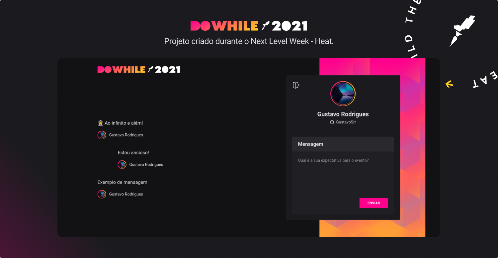

<h1 align="center">🔥 Next Level Week - Heat (🚧)</h1>

> Projeto que está sendo desenvolvido durante o Next Level Week - Heat, um evento da Rocketseat. É, basicamente, uma aplicação para compartilhar comentários sobre sua expectativa para o DoWhile.

## 🛰 Tecnologias
  
  - Até agora:
    - [Node](https://nodejs.org/)
    - [TypeScript](https://www.typescriptlang.org/)
    - [Prisma](https://prisma.io/)
    - [Socket.io](https://socket.io/)
    - [Vite](https://vitejs.dev/)
    - [React](https://reactjs.org/)
    - [Expo](https://expo.dev/)
    - [React Native](https://reactnative.dev/)
    - [Moti](https://moti.fyi/)
    
  - Logo mais:
    - [Elixir](https://elixir-lang.org/)

---

### 👷 Em breve mais atualizações...
